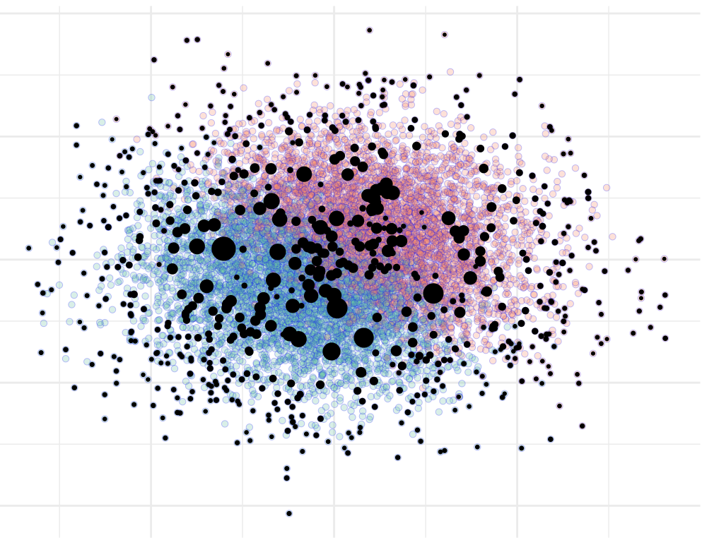

# vanillabayescoresets 

This package implements [Bayesian
coresets](https://arxiv.org/abs/1710.05053) for binary logistic
regression data. The types of coresets that are currently supported are
the [uniform coresets](https://arxiv.org/abs/1605.06423) and the
[Hilbert Frank–Wolfe coresets](https://arxiv.org/abs/1710.05053).

Through vanillabayescoresets’ functions you will be able to:

  - **construct** uniform or Hilbert Frank-Wolfe coresets for binary
    logistic regression data, setting the size of the coreset along with
    other construction parameters.
  - **plot** the coreset selected over the full dataset, for the case
    with two covariates, to visualize which datapoints are selected and
    what weight is assigned to them by the two methods.
  - quickly **generate** synthetic binary data, customizing the size of
    the sample, the number and the generative model of covariates and
    the model parameters.

Please see our [vignette](vignettes/vanilla_bayesian_coresets.Rmd) for
more information and a walk-through of the capabilities of this package.

## References

The functions implemented in vanillabayescoresets in R are simplified
versions of some of the functions implemented in Python by the packages
[lrcoresets](https://bitbucket.org/jhhuggins/lrcoresets/src/master/coresets/)
and
[bayesian-coresets](https://github.com/trevorcampbell/bayesian-coresets),
created by Jonathan H. Huggins and Trevor Campbell.

Here is a list of publications on this framework:

  - J. Huggins, T. Campbell and T. Broderick, [“Coresets for scalable
    Bayesian logistic regression”](https://arxiv.org/abs/1710.05053)
    (2016)
  - T. Campbell and T. Broderick, [“Bayesian coreset construction via
    Greedy Iterative Geodesic Ascent”](https://arxiv.org/abs/1802.01737)
    (2018)
  - T. Campbell and T. Broderick, [“Automated scalable Bayesian
    inference via Hilbert coresets”](https://arxiv.org/abs/1710.05053)
    (2019)
  - T. Campbell and B. Beronov, [“Sparse Variational Inference: Bayesian
    Coresets from Scratch”](https://arxiv.org/abs/1906.03329) (2019)
